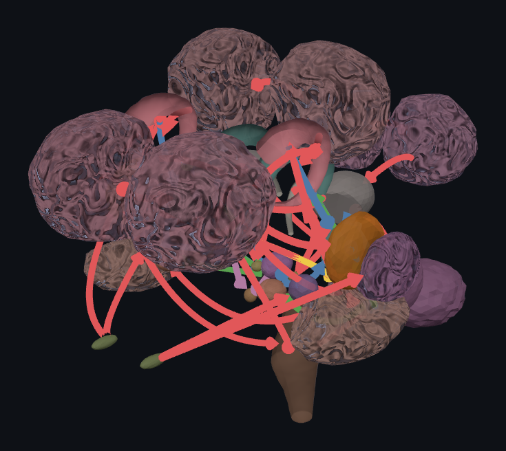

# neurarium

> [!WARNING]
> **Work in progress, and very probably wrong.** neurarium is under active
> development and far from complete. None of the anatomy has been reviewed or
> sourced yet, so the regions, shapes, projections, and descriptions very likely
> contain hallucinations and outright errors. The drug data is machine-extracted
> from a single source (Stahl's Prescriber's Guide) and likewise unreviewed, so
> the classes, targets, and bindings may be wrong or incomplete. Do not rely on
> any of it, and never use it for medical decisions.

neurarium is an interactive 3D brain visualizer that runs in the browser. It
shows brain regions (cortical lobes, basal ganglia / deep nuclei, diencephalon,
limbic, hindbrain) as
3D shapes and draws arrows for neuron projections between them. It also carries a
dataset of neurotransmitter **receptors** (which regions express each) and a
dataset of psychiatric **drugs** (what each does to the brain, animated).

Live at [neurarium.olicorne.org](https://neurarium.olicorne.org).



## Contents

- [Features](#features)
  - [Visualization](#visualization)
  - [Exploring the anatomy](#exploring-the-anatomy)
  - [Controls](#controls)
  - [Data & sourcing](#data--sourcing)
  - [Deep links & screenshots](#deep-links--screenshots)
- [Roadmap](#roadmap)
- [Feedback](#feedback)
- [Running](#running)
- [Project layout](#project-layout)
- [Stack](#stack)
- [Credits](#credits)
- [License](#license)

## Features

### Visualization

- Brain regions (cortical lobes, basal ganglia / deep nuclei, diencephalon,
  limbic, hindbrain) as procedurally shaped 3D meshes: gyrified cortex, smooth
  deep nuclei, foliated cerebellum, and swept tubes for the caudate, the brainstem
  levels (midbrain, pons, medulla), hippocampus, cingulate, and fornix.
- At rest the regions lock together into a whole brain; an intro animation
  assembles them from an exploded state on load.
- Curved arrows for directed neuron projections, colored by type (excitatory,
  inhibitory, dopaminergic, cholinergic, neuroendocrine), with a cone at the
  target end (both ends for reciprocal / commissural pathways).

### Exploring the anatomy

- **Click a region** to open an info panel with its name, group, a **Wikipedia
  link**, and the list of pathways touching it; click a pathway row to jump to it.
- **Click an arrow** to see that pathway's details: route, type, neurotransmitter,
  a one-line description, and its **sources**.
- **Search** (the magnifier) filters regions (by name), connections (by pathway
  label), receptors (by name / neurotransmitter / system) and drugs (by name /
  category / target), and frames whatever
  you pick.
- **Legend** isolates what you click: a region (both hemispheres), a whole
  category, a named **functional circuit** (its pathways light up and a pulse
  travels around the loop), or a single **neurotransmitter** (only those pathways
  and their endpoints stay lit, everything else fades). A separate,
  off-by-default **Hypothetical pathways** section reveals speculative / less-
  certain connections, drawn as dotted arrows.
- **Receptors** section: a focusable list of neurotransmitter receptors. Click one
  to dim the brain to just the regions expressing it and scatter glowing dots over
  them, with an info panel showing its system, mechanism class, excitatory /
  inhibitory sign, synaptic site, and where it is found.
- **Drugs** section: a filterable list of psychiatric drugs (from Stahl's
  Prescriber's Guide). Click one to dim the brain to the regions it acts on and
  animate effect-coloured dots (boost / block / modulate) over them, with an info
  panel showing its molecular-structure diagram, class, nomenclature, the
  molecular targets it binds and how, and the source.
- **Hover / tap** a region to show its floating name; a **Show all names** button
  labels everything at once, and a **Hide projections** button clears the arrows.

### Controls

- **Auto-rotate** the view (on by default; stops as soon as you pick something).
- **Separate** slider spreads the regions apart to reveal the deep structures
  (**Shift + scroll** drives it too; plain scroll zooms).
- **Transparency** slider to see through the outer regions.
- Rotate with one finger / left-drag, pinch to zoom, two-finger drag to pan;
  double-click a region to frame it, or empty space to recenter.

### Data & sourcing

- The anatomy is plain **structured data** under `public/data/`, split by record
  type: `structures.jsonl`, `projections.jsonl`, `circuits.jsonl`,
  `receptors.jsonl`, `drugs.jsonl` (one JSON object per line) plus a
  self-describing `meta.json`
  carrying the colour and legend-heading maps, and one geometry file per shape
  under `public/data/shapes/`. It is generated from a single source
  (`tools/generate_data.py`, with the drug list in `tools/drugs_data.json`) and
  easy to consume from another engine.
- Every projection carries a **neurotransmitter** and a list of **sources**
  (citations; a verified link renders as a hyperlink). Every region, every
  receptor, and every drug links to its **Wikipedia** article.
- **Source provenance pills.** Every source and reference shown in a detail panel
  carries a small coloured pill grading *how trustworthy its attribution is*,
  because the data is LLM-assisted and not yet human-checked. Hover (or tap, on
  touch) any pill for the full explanation. The grades:
  - **grey `?` (LLM-only)**: produced by an LLM from memory, not checked against
    any document, so it may be a hallucination.
  - **yellow `~` (sourced)**: written by an LLM that was given the source document
    (e.g. Stahl's guide), but the specific claim was not quote-verified.
  - **green `✓` (verified)**: an LLM extracted a quote, the quote was
    *programmatically* confirmed to appear in the source, and a separate LLM
    agreed it supports the claim. This is the **highest** grade available and is
    **still LLM-driven**, so it can still be wrong: going further would take
    considerable human effort, itself error-prone, and is out of scope here.
  - **orange `NOSOURCE`**: there is no source/reference for that claim yet.

  The grade lives in the data (`generate_data.py`), so a source is upgraded as it
  is checked. A single **"?"** caveat per detail panel (and the **Sources &
  provenance** section in the About panel, which carries the same grade key and
  the coverage figures below) repeats that none of it is human-verified.

<!-- SOURCING_STATS:START (generated by tools/update_readme_stats.py; do not edit by hand) -->

**70% of the 943 factual claims in the dataset are sourced or verified.** This is a programmatic count (`tools/update_readme_stats.py`, from the emitted data), not hand-typed:

| Claim kind | Sourced or verified |
| --- | --- |
| Drug target bindings | 403 / 429 (94%) |
| Drug nomenclature (NbN) | 113 / 116 (97%) |
| Drug descriptions | 140 / 158 (89%) |
| Neuron pathways | 0 / 107 (0%) |
| Receptor classifications | 0 / 56 (0%) |
| Target classifications | 0 / 25 (0%) |
| Brain-region anatomy | 0 / 52 (0%) |
| Wikipedia reference links | 0 / 298 (0%) |

<!-- SOURCING_STATS:END -->

  (Regenerate this table with `python tools/update_readme_stats.py` after the
  sourcing changes; it reads the programmatic tally from `meta.json`. Neuron
  pathways and Wikipedia reference links are the remaining gap.)
- Each receptor records its **neurotransmitter**, mechanism class (ionotropic /
  metabotropic / chaperone), excitatory / inhibitory / modulatory **sign**,
  synaptic site, and the regions expressing it.
- Each drug records its coarse **class** and Neuroscience-based Nomenclature, plus
  the **bindings** it has (the molecular target and the action: agonist,
  antagonist, reuptake inhibitor, ...), sourced from **Stahl's Prescriber's Guide
  (8th ed.)** under fair-use sourcing and extracted strictly from that text (gaps
  left as **TODO**).

### Deep links & screenshots

- The view is URL-addressable: `?only=`, `?view=`, `?explode=`, `?transparency=`,
  `?names=all`, `?autorotate=1`, `?ui=0` (see the table in
  [`CLAUDE.md`](CLAUDE.md)). `tools/shot.py` uses the same params to render PNGs.
- On-screen debug console via [eruda](https://github.com/liriliri/eruda), loaded
  only in dev or with `?debug`; runtime errors otherwise surface as dismissible
  on-screen banners.

## Roadmap

Planned directions, none implemented yet and the order is not fixed:

- **More animation**: build on the assemble intro, the circuit traveling-pulse,
  and the per-drug effect dots to show wider activity and signal flow across the
  brain.
- **Pathologies**: how disorders map onto the regions, circuits, and
  neurotransmitter systems.
- **Verify the sources**: every citation currently carries a placeholder
  **TODO** url; replace each one with a verified DOI/link. Relatedly, lift each
  source's **provenance grade** (see "Data & sourcing") from the default grey
  (LLM-only) toward yellow/green as it is checked.

## Feedback

Found a bug, an anatomical or pharmacological **inaccuracy**, or have a **feature
request**? Please **open an issue** on this repository. Given the work-in-progress
warning above, corrections to the regions, projections, receptor, and drug data
are especially welcome.

## Running

The page loads its data with `fetch()`, so it must be served over HTTP (not
opened directly from disk). The served site is `public/`. From the repository
root:

```sh
python tools/serve.py            # serves public/ with caching disabled
# or: cd public && python -m http.server 8000
```

Then open <http://localhost:8000/>.

## Project layout

| Path | Purpose |
| --- | --- |
| `public/` | The served site (and the only web-exposed directory). |
| `tools/generate_data.py` | Single source of truth for the anatomy; generates the data below. |
| `tools/drugs_data.json` | The drug dataset's authored source (read by the generator). |
| `tools/fetch_molecules.py` | Downloads each drug's molecular-structure SVG from Wikipedia (vendored same-origin). |
| `public/data/meta.json` | Presentation maps (colours, legend headings); makes the dataset self-describing. |
| `public/data/{structures,projections,circuits,receptors,drugs}.jsonl` | The anatomy + drugs, split by record type, one JSON object per line. |
| `public/data/shapes/<id>.json` | One geometry file per region. |
| `public/data/molecules/<id>.svg` | One molecular-structure diagram per drug, shown in its panel. |
| `public/index.html`, `public/js/` | The three.js viewer and UI. |
| `tools/` | Dev tooling (data generator, dev server, screenshot helper). |
| `docker/` | Deployment (hardened Caddy container). |
| `ARCHITECTURE.md` | High-level architecture: data flow, module graph, boot sequence. |
| `CLAUDE.md` | The exhaustive file-by-file map and how to extend the anatomy. |

To change which regions or projections are shown, edit `tools/generate_data.py`
and run `python tools/generate_data.py` to regenerate `public/data/`
(`meta.json` + the `*.jsonl` files + `shapes/`). See [`CLAUDE.md`](CLAUDE.md) for
details.

## Stack

Deliberately lightweight, with a small attack surface and no build step:

- **Frontend**: vanilla ES modules + [three.js](https://threejs.org/) loaded via
  an import map. three.js is vendored under `public/vendor/three`, so the page
  executes no third-party script at runtime and works offline. No framework, no
  bundler, no `node_modules`.
- **Data**: `tools/generate_data.py` (Python standard library only) emits the
  anatomy as the `public/data/` files (`meta.json` + `*.jsonl`) +
  `public/data/shapes/*.json`, fetched at
  runtime. The plain JSONL/JSON format is easy to consume from another engine.
- **Serving**: a hardened [Caddy](https://caddyserver.com/) container (non-root,
  read-only rootfs, dropped capabilities, resource limits) that sends a strict
  Content-Security-Policy; a reverse proxy terminates TLS in front of it.
- **Debugging**: an [eruda](https://github.com/liriliri/eruda) on-screen console,
  loaded only in dev or with `?debug` so it never ships to normal visitors.

## Credits

Built with the help of [Claude Code](https://claude.com/claude-code).

## License

[GNU Affero General Public License v3.0 (AGPL-3.0)](LICENSE).
