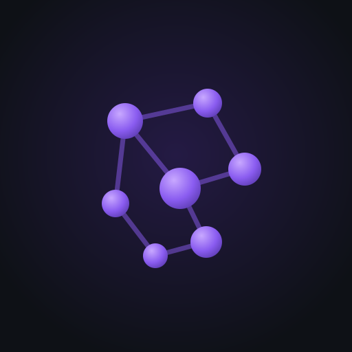
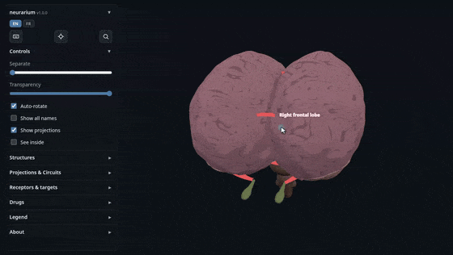

<p align="center">
  
</p>

# neurarium

*Read this in [French / en français](README.fr.md).*

neurarium is my modest attempt at a **3D brain encyclopedia** where every fact is
backed by a reputable source (a reference medical textbook, an online pharmacology
database, a research paper), reorganized into an intuitive 3D brain you can rotate,
pull apart, search, and click through.

Brain knowledge normally lives scattered across atlases, pathway diagrams, receptor
tables, and drug monographs. neurarium lays it onto a single 3D model so the
*relationships* (which region projects where, which receptor sits in which structure,
what a drug does and to what) are visible at a glance instead of reconstructed in your
head. Because the dataset is machine-assembled, every fact carries a colored grade
telling you how well it is sourced, so you always know how much to trust it.

Live at **[neurarium.olicorne.org](https://neurarium.olicorne.org)**.

[](https://neurarium.olicorne.org)

> [!IMPORTANT]
> <!-- SOURCED_HEADLINE:START --><b>96% of the 3952 knowledge nodes are sourced or verified</b><!-- SOURCED_HEADLINE:END -->
> in the shipped dataset, and every fact in the app carries a provenance grade you
> can inspect (see [How does the sourcing work?](#how-does-the-sourcing-work)).

> [!WARNING]
> **Work in progress: it very likely contains mistakes.** The anatomy (regions,
> shapes, projections, descriptions) is not yet reviewed or sourced and may contain
> model hallucinations; the drug data is machine-extracted (psychiatric drugs from
> Stahl's *Prescriber's Guide*, other substances from measured PDSP Ki affinities) and
> likewise unreviewed. neurarium is an early tool for exploring and learning or finding sources but **not** as a
> primary clinical reference: do not rely on it, and never bet a patient's care solely on it.

## FAQ

- [What kind of information is inside?](#what-kind-of-information-is-inside)
- [Who made neurarium?](#who-made-neurarium)
- [Why did you make it?](#why-did-you-make-it)
- [Is it free?](#is-it-free)
- [How do I run it myself?](#how-do-i-run-it-myself)
- [How does the sourcing work?](#how-does-the-sourcing-work)
- [What are the sources?](#what-are-the-sources)
- [How can I reuse the data?](#how-can-i-reuse-the-data)
- [What's the license, and why?](#whats-the-license-and-why)
- [What's on the roadmap?](#whats-on-the-roadmap)
- [What is it built with?](#what-is-it-built-with)
- [How do I give feedback or get in touch?](#how-do-i-give-feedback-or-get-in-touch)

<a name="what-kind-of-information-is-inside"></a>
<details>
<summary><strong>What kind of information is inside?</strong></summary>

Four layers of data on one model, all clickable:

| Layer | What you see | What you can do with it |
| --- | --- | --- |
| **Anatomy** | Cortical lobes, basal ganglia, diencephalon, limbic, and hindbrain as one procedural 3D mesh | Rotate, explode on a slider to reveal the deep nuclei, go transparent, peel away the near side, or isolate a single structure |
| **Wiring** | Neuron projections as directed arrows, colored by type (excitatory, dopaminergic, ...) or by excitatory/inhibitory sign | Click a pathway for its route, transmitter, and sources; play a named **functional circuit** as a traveling pulse |
| **Receptors & targets** | Receptors plus other molecular targets (transporters, enzymes, ion channels) | Focus one: the brain dims to the structures expressing it (scattered with glowing dots), beside its class, sign, and every drug acting on it |
| **Drugs** | Psychiatric drugs (from Stahl's *Prescriber's Guide*) alongside recreational and other psychoactive substances (LSD, MDMA, ketamine, cocaine, nicotine, ...), and open to more: a drug is just a row of sourced bindings, so any substance with published affinities can be added | Focus one: effect-colored dots (boost / block / modulate) animate over the regions it touches, beads flow along the transmitter systems it works through, and the panel shows its structure, class, bindings, and each binding's source |
| **Everything** | One search box; fully URL-addressable state | Search regions, pathways, receptors, and drugs at once; pivot from a drug to its class or from a target to every drug that hits it; share any view as a deep link |

Under the hood it is a **graph of nodes**. A *node* is any sourceable datum: a brain
region, a projection between two regions, a functional circuit, a receptor, a
receptor's expression in a given region, a drug, a single drug-to-target binding.
Nodes interlink, so a detail panel is a view of **one node plus every node linked to
it**, and you explore outward from whatever you clicked.

</details>

<a name="who-made-neurarium"></a>
<details>
<summary><strong>Who made neurarium?</strong></summary>

Initialy built in less than a week by [Olivier Cornelis](https://olicorne.org/), french developer and resident psychiatrist, with
the help of [Claude Code](https://claude.com/claude-code).

</details>

<a name="why-did-you-make-it"></a>
<details>
<summary><strong>Why did you make it?</strong></summary>

It began as a few-days demo during my medical residency, and it has kept absorbing new
kinds of data more easily than expected. The recurring frustration it answers: the
facts you need to reason about the brain are true but *scattered*, its regions in one
atlas, its wiring in another, its receptors in a table, its drugs in monographs, so you
spend your effort reconstructing the connections instead of using them. Putting them on
one map, each with a visible source grade, makes those connections the thing you look
at.

As a strong believer in the usefulness of reorganizing information as structured data, I believe this kind of interactive, source-graded viewer could be useful beyond
psychopharmacology, and I would happily build similar animations for **other medical
topics**. If you think a map like this would help your teaching or research, please
[get in touch](https://olicorne.org/en/contact).

</details>

<a name="is-it-free"></a>
<details>
<summary><strong>Is it free?</strong></summary>

Yes. It is free to use at [neurarium.olicorne.org](https://neurarium.olicorne.org),
free and open source (see [the license](#whats-the-license-and-why)), and the
underlying data is free to reuse (see [How can I reuse the data?](#how-can-i-reuse-the-data)).
No account, no tracking beyond basic anonymous usage counts, no paywall.

</details>

<a name="how-do-i-run-it-myself"></a>
<details>
<summary><strong>How do I run it myself?</strong></summary>

The page loads its data with `fetch()`, so it must be served over HTTP (not opened from
disk). The served site is `public/`. From the repository root:

```sh
python tools/serve.py            # serves public/ with caching disabled
# or: cd public && python -m http.server 8000
```

Then open <http://localhost:8000/>.

For deployment there is a hardened [Caddy](https://caddyserver.com/) container under
`docker/`; the full data flow and module graph are in
[`ARCHITECTURE.md`](docs/ARCHITECTURE.md).

</details>

<a name="how-does-the-sourcing-work"></a>
<details>
<summary><strong>How does the sourcing work?</strong></summary>

Because the dataset is large and machine-assembled, the honest question for any node is
*how do we know this?* Every source shown in a panel answers it inline with a colored
**provenance pill**. The goal is that **every node carries a source**, and the pill
makes the gaps visible. From weakest to strongest:

- **orange `NOSOURCE`:** no source or reference for that node yet.
- **grey `?` (LLM-only):** produced by a model from memory, unchecked; may be a hallucination.
- **yellow `~` (sourced):** from the cited document, but the node itself was not quote-verified.
- **green `✓` (verified):** a model extracted a quote, it was *programmatically* confirmed present in the cited source, and a second model agreed it supports the node. Highest grade available, and still model-driven.

The grade is part of the data, upgraded as each node is checked, so the coverage below
is a real count:

<!-- SOURCING_STATS:START (generated by tools/update_readme_stats.py; do not edit by hand) -->

**96% of the 3952 knowledge nodes in the dataset are sourced or verified.** A node is any sourceable datum (a region, a pathway, a receptor, a drug binding, ...). This is a programmatic count (`tools/update_readme_stats.py`, from the emitted data), not hand-typed:

```
Drug brand names                ██████████████████████████  100%    469/469
Wikipedia reference links       ██████████████████████████  100%    371/371
Drug metabolising enzymes       ██████████████████████████  100%    268/268
Drug half-life (T½)             ██████████████████████████  100%    185/185
Drug nomenclature (NbN)         ██████████████████████████  100%    116/116
Receptor system/family          ██████████████████████████  100%      56/56
Brain-region anatomy            ██████████████████████████  100%      54/54
Drug metabolite bindings        ██████████████████████████  100%      48/48
Drug active metabolites         ██████████████████████████  100%      36/36
Target classifications          ██████████████████████████  100%      20/20
Projection groups               ██████████████████████████  100%      11/11
Functional circuits             ██████████████████████████  100%        6/6
Target tone polarity            ██████████████████████████  100%        2/2
Receptor mechanism class        ██████████████████████████   98%      55/56
Drug target bindings            █████████████████████████░   98%  1655/1688
Neuron pathways                 █████████████████████████░   97%      56/58
Receptor expression regions     ████████████████████████░░   94%    360/383
Target expression regions       ██████████████████████░░░░   85%      82/96
Drug class                      ██████████████████████░░░░   85%    199/235
Receptor sign (excit./inhib.)   ████████████████████░░░░░░   77%      43/56
Receptor pre/postsynaptic site  ████░░░░░░░░░░░░░░░░░░░░░░   14%       8/56
```

Separately, **measured binding affinity (PDSP Ki) covers 83% of the 1661 drug bindings**; 70 of 220 drugs carry no Ki on any binding (sourced by book quote only, or not yet sourced). A Ki is a measured value, not a grade: this tracks where one was never looked up, complementing the sourcing figure above.

<!-- SOURCING_STATS:END -->

</details>

<a name="what-are-the-sources"></a>
<details>
<summary><strong>What are the sources?</strong></summary>

<!-- SOURCES_TABLE:START (generated by tools/update_readme_stats.py; do not edit by hand) -->

Every `~` and `✓` grade is checked against one of the sources below. Each is a standard, widely cited reference in its field, not a casual web page:

| Source | Field | Grades here |
| --- | --- | --- |
| Prescriber's Guide: Stahl's Essential Psychopharmacology, 8th ed. | Clinical psychopharmacology | Drug bindings, nomenclature, class |
| Kandel, Principles of Neural Science, 6th ed. | Neuroscience (standard textbook) | Neuron pathways, region anatomy |
| Stahl's Essential Psychopharmacology: Neuroscientific Basis, 5th ed. | Psychopharmacology (mechanisms) | Receptor & target mechanism |
| Carlat Medication Fact Book for Psychiatric Practice, 7th ed. | Clinical psychopharmacology | Drug bindings (cross-check) |
| Nieuwenhuys, Voogd & van Huijzen, The Human Central Nervous System, 4th ed. | Neuroanatomy (CNS atlas) | Region anatomy, connectivity |
| [IUPHAR/BPS Guide to Pharmacology (GtoPdb), tissue distribution](https://www.guidetopharmacology.org/) | Molecular pharmacology (IUPHAR/BPS database) | Receptor & target expression regions |
| [PDSP Ki Database (NIMH PDSP)](https://pdspdb.unc.edu/databases/kidb.php) | Receptor binding pharmacology | Drug binding affinities (Ki) |
| [Allen Human Brain Atlas, microarray (Hawrylycz et al. 2012)](https://human.brain-map.org/) | Brain transcriptome atlas (microarray) | Receptor & target expression regions |
| [Wikipedia (English), drug article (pharmacology sections)](https://en.wikipedia.org/) | Encyclopedia (pharmacodynamics tables) | Drug binding affinities (Ki) |
| [Wikipedia (French), drug article (commercial names)](https://fr.wikipedia.org/) | Encyclopedia (French, article prose) | Drug brand names (European / French) |
| [IUPHAR/BPS Guide to Pharmacology (GtoPdb), ligand interactions](https://www.guidetopharmacology.org/) | Molecular pharmacology (IUPHAR/BPS database) | Drug binding affinities (Ki) and direction |
| [IUPHAR/BPS Guide to Pharmacology (GtoPdb), target classification](https://www.guidetopharmacology.org/) | Molecular pharmacology (IUPHAR/BPS database) | Receptor & target mechanism class, receptor sign |

<!-- SOURCES_TABLE:END -->

**Wikipedia** sits outside the table above. The drug and structure descriptions and the
molecule images are fetched live from the current Wikipedia article at runtime (under
[CC BY-SA](https://creativecommons.org/licenses/by-sa/4.0/)), so the dataset ships no
copyrighted prose. A live fetch is a verbatim, programmatic read that cannot drift from
the source, so in the app these carry a green `✓` pill; they are tallied as reference
links (the "Wikipedia reference links" row in the coverage above), kept separate from
the knowledge-node total.

The book references are copyrighted, so only the tooling that uses them is committed,
not the text. Anyone holding a copy can reproduce the extraction and confirm every
`✓`-graded quote: drop the Stahl PDF into `data_sources/books/stahl/` and three
committed scripts rebuild exactly what the gate checks against:

```sh
uv run tools/fetch/pdf_to_pages.py    # the PDF -> one Markdown file per page
uv run tools/fetch/build_index.py     # the per-drug page index
python tools/check_data.py            # re-verifies every quote is on its cited page
```

</details>

<a name="how-can-i-reuse-the-data"></a>
<details>
<summary><strong>How can I reuse the data?</strong></summary>

The anatomy is plain **structured data**, kept deliberately separate from the
rendering. Under `public/data/` it is split by node kind (one JSON object per line)
beside a self-describing `meta.json` (colour and legend maps plus the sourcing tally)
and one geometry file per shape. It is generated from a single source of truth
(`tools/generate_data.py`, with the drug list in `tools/data/drugs_data.jsonl`), so the
plain JSONL/JSON is easy to consume from another engine.

| File | What it holds |
| --- | --- |
| [`structures.jsonl`](public/data/structures.jsonl) | Brain regions (position, group, geometry ref, sources) |
| [`projections.jsonl`](public/data/projections.jsonl) | Neuron pathways (from -> to, transmitter, sign, sources) |
| [`circuits.jsonl`](public/data/circuits.jsonl) | Named functional circuits |
| [`projection_groups.jsonl`](public/data/projection_groups.jsonl) | By-transmitter / by-effect pathway groups |
| [`receptors.jsonl`](public/data/receptors.jsonl) | Receptors: classification + expression regions, each graded |
| [`drugs.jsonl`](public/data/drugs.jsonl) | Drugs: bindings (target, action, Ki), class, nomenclature |

Each row of every file carries its own provenance grade and source, so the graph stays
self-describing. For how to extend the dataset, the per-tool reference, and the
emitted-data field contract, see [`tools/README.md`](tools/README.md). The data is under
the same [license](#whats-the-license-and-why) as the code.

</details>

<a name="whats-the-license-and-why"></a>
<details>
<summary><strong>What's the license, and why?</strong></summary>

[GNU Affero General Public License v3.0 (AGPL-3.0)](LICENSE).

I chose a strong copyleft license on purpose: anyone is free to use, study, modify, and
build on neurarium, but any reuse or hosting of it (including a modified version run as
a website) must keep its source open under the same terms. The point is to keep the
work and its data freely available and prevent it from being closed off into a
proprietary fork.
Drug descriptions and molecular-structure images come from Wikipedia, used under [CC BY-SA](https://creativecommons.org/licenses/by-sa/4.0/).

</details>

<a name="whats-on-the-roadmap"></a>
<details>
<summary><strong>What's on the roadmap?</strong></summary>

A sample of the planned directions, none fixed in order: **more animation** of activity
and signal flow across the brain; **more substances** with their commercial brand
names; **pathologies** mapped onto regions, circuits, and transmitter systems; **deeper
pharmacology** (CYP enzymatic interactions, second-order receptor effects);
**consistency checks** that flag self-contradicting data; and **toward full sourcing**,
lifting every node's grade from grey toward green as it is checked.

</details>

<a name="what-is-it-built-with"></a>
<details>
<summary><strong>What is it built with?</strong></summary>

Deliberately lightweight, with a small attack surface and no build step:

- **Frontend:** vanilla ES modules + [three.js](https://threejs.org/) loaded via an
  import map and vendored under `public/vendor/three`, so the page runs no third-party
  script at runtime and works offline. No framework, bundler, or `node_modules`.
- **Data:** `tools/generate_data.py` (Python standard library only) emits the anatomy
  as `public/data/` (`meta.json` + `*.jsonl` + `shapes/*.json`), fetched at runtime.
- **Serving:** a hardened [Caddy](https://caddyserver.com/) container (non-root,
  read-only rootfs, dropped capabilities, resource limits, strict Content-Security-
  Policy) behind a TLS-terminating reverse proxy.
- **Debugging:** an [eruda](https://github.com/liriliri/eruda) on-screen console,
  loaded only in dev or with `?debug` so it never ships to normal visitors.

For the viewer's file-by-file map and the non-obvious rules, see
[`CLAUDE.md`](CLAUDE.md).

</details>

<a name="how-do-i-give-feedback-or-get-in-touch"></a>
<details>
<summary><strong>How do I give feedback or get in touch?</strong></summary>

Found a bug, an anatomical or pharmacological **inaccuracy**, or have a **feature
request**? Please **open an issue** on this repository. Corrections to the regions,
projections, receptor, and drug data are especially welcome, as are **ideas for what
else belongs on a map like this**.

For anything else, or to talk about a similar viewer for another medical topic, you can
reach me on [my website](https://olicorne.org/en/contact).

</details>
