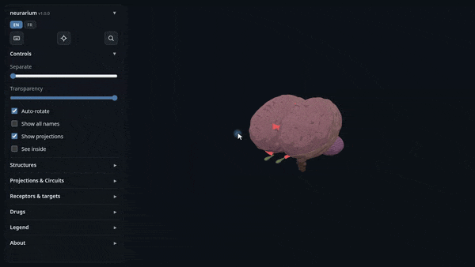

# neurarium

**A free, source-graded 3D atlas of the human brain: every region, pathway,
receptor, and drug is a graded, inspectable node on one map you can rotate, pull
apart, search, and click through.**

> [!IMPORTANT]
> <!-- SOURCED_HEADLINE:START --><b>96% of the 1745 knowledge nodes are sourced or verified</b><!-- SOURCED_HEADLINE:END -->
> in the shipped dataset, and every fact in the app carries a provenance grade you
> can inspect. This is a real programmatic count of the data (see
> [Every node is graded](#every-node-is-graded)).

Live at [neurarium.olicorne.org](https://neurarium.olicorne.org).

[](https://neurarium.olicorne.org)

> [!WARNING]
> **Work in progress: it very likely contains mistakes.** The anatomy (regions,
> shapes, projections, descriptions) is not yet reviewed or sourced and may contain
> model hallucinations; the drug data is machine-extracted from a single source
> (Stahl's *Prescriber's Guide*) and likewise unreviewed. Do not rely on any of it,
> and never use it for medical decisions.

neurarium takes facts that normally live scattered across atlases, pathway diagrams,
receptor tables, and drug monographs, and lays them onto a single 3D model. The point
is to make the *relationships* between them (which region projects where, which
receptor sits in which structure, what a drug does and to what) visible at a glance
rather than reconstructed in your head. Under the hood it is a **graph of nodes**, and
because the dataset is machine-assembled, every node carries a source grade so you
always know how much to trust it.

## What you can explore

| Layer | What you see | What you can do with it |
| --- | --- | --- |
| **Anatomy** | Cortical lobes, basal ganglia, diencephalon, limbic, and hindbrain as one procedural 3D mesh | Rotate, explode on a slider to reveal the deep nuclei, go transparent, peel away the near side, or isolate a single structure |
| **Wiring** | Neuron projections as directed arrows, colored by type (excitatory, dopaminergic, ...) or by excitatory/inhibitory sign | Click a pathway for its route, transmitter, and sources; play a named **functional circuit** as a traveling pulse |
| **Receptors & targets** | Receptors plus other molecular targets (transporters, enzymes, ion channels) | Focus one: the brain dims to the structures expressing it (scattered with glowing dots), beside its class, sign, and every drug acting on it |
| **Drugs** | Psychiatric drugs from Stahl's *Prescriber's Guide* | Focus one: effect-colored dots (boost / block / modulate) animate over the regions it touches, beads flow along the transmitter systems it works through, and the panel shows its structure, class, bindings, and each binding's source |
| **Everything** | One search box; fully URL-addressable state | Search regions, pathways, receptors, and drugs at once; pivot from a drug to its class or from a target to every drug that hits it; share any view as a deep link |

## Every node is graded

A *node* is any sourceable datum: a brain region, a projection between two regions, a
functional circuit, a receptor, a receptor's expression in a given region, a drug, a
single drug-to-target binding. Nodes interlink (a receptor links to the regions
expressing it and the drugs acting on it), and a detail panel is a view of **one node
plus every node linked to it**, so you explore outward from whatever you clicked.

Because the dataset is large and machine-assembled, the honest question for any node
is *how do we know this?* Every source shown in a panel answers it inline with a
colored **provenance pill**. The design goal is that **every node carries a source**,
and the pill makes the gaps visible. From weakest to strongest:

- **grey `?` (LLM-only):** produced by a model from memory, unchecked; may be a hallucination.
- **yellow `~` (sourced):** from the cited document, but the node itself was not quote-verified.
- **green `✓` (verified):** a model extracted a quote, it was *programmatically* confirmed present in the cited source, and a second model agreed it supports the node. Highest grade available, and still model-driven.
- **orange `NOSOURCE`:** no source or reference for that node yet.

The grade is part of the data, upgraded as each node is checked, so the coverage below
is a real count:

<!-- SOURCING_STATS:START (generated by tools/update_readme_stats.py; do not edit by hand) -->

**96% of the 1745 knowledge nodes in the dataset are sourced or verified.** A node is any sourceable datum (a region, a pathway, a receptor, a drug binding, ...). This is a programmatic count (`tools/update_readme_stats.py`, from the emitted data), not hand-typed:

```
Wikipedia reference links    ██████████████████████████  100%  305/305
Drug nomenclature (NbN)      ██████████████████████████  100%  116/116
Brain-region anatomy         ██████████████████████████  100%    52/52
Projection groups            ██████████████████████████  100%    10/10
Functional circuits          ██████████████████████████  100%      6/6
Drug target bindings         ██████████████████████████   98%  691/703
Receptor classifications     █████████████████████████░   96%    54/56
Neuron pathways              █████████████████████████░   96%   99/103
Drug class                   █████████████████████████░   95%  156/165
Receptor expression regions  ████████████████████████░░   94%  360/383
Target expression regions    ███████████████████████░░░   87%  108/124
Target classifications       ██████████████████████░░░░   84%    21/25
Target tone polarity         █████████████░░░░░░░░░░░░░   50%      1/2
```

<!-- SOURCING_STATS:END -->

Drug bindings lead because they pass the full quote-verification gate; the anatomy,
pathways, and expression regions are the current frontier. The same key and coverage
bar live in the app's About panel.

**On the sources.**

<!-- SOURCES_TABLE:START (generated by tools/update_readme_stats.py; do not edit by hand) -->

Every `~` and `✓` grade is checked against one of the sources below. Each is a standard, widely cited reference in its field, not a casual web page:

| Source | Field | Grades here |
| --- | --- | --- |
| Prescriber's Guide: Stahl's Essential Psychopharmacology, 8th ed. | Clinical psychopharmacology | Drug bindings, nomenclature, class |
| Kandel, Principles of Neural Science, 6th ed. | Neuroscience (standard textbook) | Neuron pathways, region anatomy |
| Stahl's Essential Psychopharmacology: Neuroscientific Basis, 5th ed. | Psychopharmacology (mechanisms) | Receptor & target mechanism |
| Carlat Medication Fact Book for Psychiatric Practice, 7th ed. | Clinical psychopharmacology | Drug bindings (cross-check) |
| Nieuwenhuys, Voogd & van Huijzen, The Human Central Nervous System, 4th ed. | Neuroanatomy (CNS atlas) | Region anatomy, connectivity |
| [IUPHAR/BPS Guide to Pharmacology (GtoPdb), tissue distribution](https://www.guidetopharmacology.org/) | Molecular pharmacology (IUPHAR/BPS database) | Receptor & target expression regions |
| [PDSP Ki Database (NIMH PDSP)](https://pdspdb.unc.edu/databases/kidb.php) | Receptor binding pharmacology | Drug binding affinities (Ki) |
| [Allen Human Brain Atlas, microarray (Hawrylycz et al. 2012)](https://human.brain-map.org/) | Brain transcriptome atlas (microarray) | Receptor & target expression regions |

<!-- SOURCES_TABLE:END -->

The book references are copyrighted, so only the tooling that uses them is committed,
not the text. Anyone holding a copy can reproduce the extraction and confirm every
`✓`-graded quote: drop the Stahl PDF into `sources/books/stahl/` and three committed
scripts rebuild exactly what the gate checks against:

```sh
uv run tools/pdf_to_pages.py    # the PDF -> one Markdown file per page
uv run tools/build_index.py     # the per-drug page index
python tools/check_data.py      # re-verifies every quote is on its cited page
```

## Built to be reused

The anatomy is plain **structured data**, kept deliberately separate from the
rendering. Under `public/data/` it is split by node kind (`structures`, `projections`,
`circuits`, `receptors`, `drugs`; one JSON object per line) beside a self-describing
`meta.json` (colour and legend maps plus the sourcing tally) and one geometry file per
shape. It is generated from a single source of truth (`tools/generate_data.py`, with
the drug list in `tools/drugs_data.json`), so the plain JSONL/JSON is easy to consume
from another engine.

For the full data flow and module graph see [`ARCHITECTURE.md`](ARCHITECTURE.md); for how
to extend the dataset, the per-tool reference, and the emitted-data field contract see
[`tools/README.md`](tools/README.md); for the viewer's file-by-file map and the non-obvious
rules see [`CLAUDE.md`](CLAUDE.md).

## Roadmap

A sample of the planned directions, none fixed in order: **more animation** of
activity and signal flow across the brain; **more substances** (LSD, MDMA, ketamine,
nicotine, cannabis) with their commercial brand names; **pathologies** mapped onto
regions, circuits, and transmitter systems; **deeper pharmacology** (CYP enzymatic
interactions, second-order receptor effects); **consistency checks** that flag
self-contradicting data; and **toward full sourcing**, lifting every node's grade from
grey toward green as it is checked.

## Feedback

Found a bug, an anatomical or pharmacological **inaccuracy**, or have a **feature
request**? Please **open an issue** on this repository. Corrections to the regions,
projections, receptor, and drug data are especially welcome, as are **ideas for what
else belongs on a map like this**. This began as a few-days demo during my medical
residency and has kept absorbing new kinds of data more easily than expected, so
suggestions for where to take it next genuinely help. You can also find other ways to
reach me on [my website](https://olicorne.org/en/contact).

## Running

The page loads its data with `fetch()`, so it must be served over HTTP (not opened
from disk). The served site is `public/`. From the repository root:

```sh
python tools/serve.py            # serves public/ with caching disabled
# or: cd public && python -m http.server 8000
```

Then open <http://localhost:8000/>.

## Stack

Deliberately lightweight, with a small attack surface and no build step:

- **Frontend:** vanilla ES modules + [three.js](https://threejs.org/) loaded via an
  import map and vendored under `public/vendor/three`, so the page runs no third-party
  script at runtime and works offline. No framework, bundler, or `node_modules`.
- **Data:** `tools/generate_data.py` (Python standard library only) emits the anatomy
  as `public/data/` (`meta.json` + `*.jsonl` + `shapes/*.json`), fetched at runtime.
- **Serving:** a hardened [Caddy](https://caddyserver.com/) container (non-root,
  read-only rootfs, dropped capabilities, resource limits, strict Content-Security-
  Policy) behind a TLS-terminating reverse proxy.
- **Debugging:** an [eruda](https://github.com/liriliri/eruda) on-screen console,
  loaded only in dev or with `?debug` so it never ships to normal visitors.

## Credits

Built by [Olivier Cornelis](https://olicorne.org/) (developer and psychiatrist) with
the help of [Claude Code](https://claude.com/claude-code). Drug descriptions and
molecular-structure images come from Wikipedia, used under
[CC BY-SA](https://creativecommons.org/licenses/by-sa/4.0/).

## License

[GNU Affero General Public License v3.0 (AGPL-3.0)](LICENSE).
